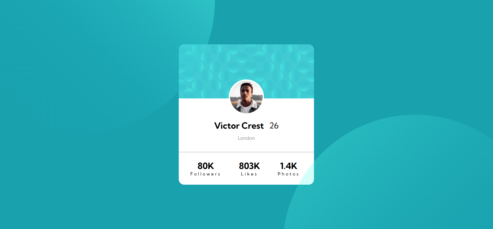
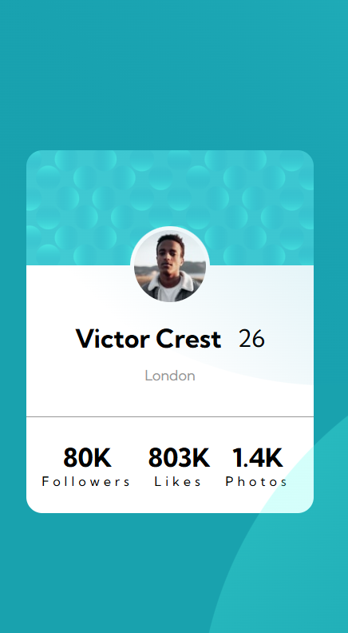

# Frontend Mentor - Profile card component solution

This is a solution to the [Profile card component challenge on Frontend Mentor](https://www.frontendmentor.io/challenges/profile-card-component-cfArpWshJ). Frontend Mentor challenges help you improve your coding skills by building realistic projects. 

## Table of contents

- [Overview](#overview)
  - [The challenge](#the-challenge)
  - [Screenshot](#screenshot)
  - [Links](#links)
- [My process](#my-process)
  - [Built with](#built-with)
  - [What I learned](#what-i-learned)
- [Author](#author)

## Overview

### The challenge

- Build out the project to the designs provided

### Screenshot

It is the desktop preview of the project.

It is the view from a mobile of this project

### Links

- Solution URL: [Frontend Mentor](https://www.frontendmentor.io/solutions/profile-card-using-css-flex-WgpTroApkc)
- Live Site URL: [Vercel](https://profile-card-wheat-ten.vercel.app)

## My process

### Built with

- Semantic HTML5 markup
- CSS custom properties
- Flexbox

## Author

- Frontend Mentor - [@methane-js](https://www.frontendmentor.io/profile/methane-js)
- Instagram - [@methane.py](https://www.instagram.com/methane.py/)
